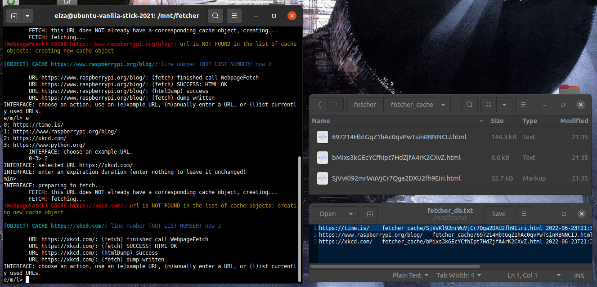
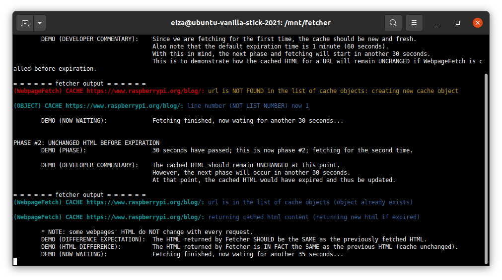
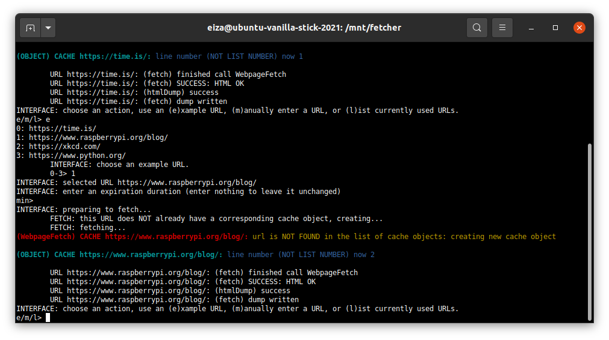

# fetcher
A system for creating and managing cache for website HTML files on local storage, complete with expiration times and garbage collection.



## Rationale and Motivation for the Project
When it comes to developing a project that interacts with a website, problems may occur when it comes to prototyping and debugging your code. Specifically, when you run your code over and over as you write it, the code may make a request to the website for each time it is executed. This results in a needlessly massive sum of requests to the website, which may get you rate limited or flagged for suspicious activity.

You *could* download a webpage as an HTML file on your disk and work on that file, but for projects with an on-and-off schedule or deal with time-sensitive websites, this becomes a cumbersome process.

But then, why not have one single function that seemlessly saves a local copy of the HTML webpage for the URLs you request and updates that copy when it is considered expired or too old to be used? This is the founding goal of Fetcher.

Fetcher allows you to focus on your project and use the HTML documents you need while it performs the dirty-work of caching and updating those HTML documents as time goes on.

## Installation and Basic Use

### Installing and Importing Fetcher
As of now, Fetcher can only be used by cloning the repository to your disk and importing Fetcher from your local clone. In the future, more elegant means of packaging such as PyPi will be utilized.

In terms of importing Fetcher, Fetcher itself is entirely self-contained in the **fetcher.py** file: other files such as **demo.py** and **tester.py** are NOT required for Fetcher to work. Therefore, you may cut/copy and paste **fetcher.py** into the same directory as another project, or vice versa, and use this import statement:

```
import fetcher
```

However, if you prefer importing Fetcher from its repository while your project is located elsewhere, you may need to follow an online tutorial for how to import Fetcher as a module in a different directory.

### Using Fetcher
Fetcher was designed to be a flexible, modular system that could be easily altered and built on with many functions; however, it is intended for developers to only use one single function in Fetcher: **WebpageFetch()**.

This is literally the one and only function you will likely ever use in Fetcher by design: this is a function that "automagically" retrieves, caches, and updates HTML documents. The developer wanting to use Fetcher does NOT need to know or study the inner-workings of Fetcher.

Therefore, this section and **demo.py** will cover the parameters and behavior of **WebpageFetch()**.

### WebpageFetch in General
Here is the pseudocode describing the overall behavior of WebpageFetch when it is called for a particular URL:

* **if**: URL/HTML in database (already cached)
	* **if**: the forced-update parameter is set to True
		* **action**: retrieve webpage and update cached HTML
	* **else, if**: the parameter is False (default)
		* **if**: the cache has expired
			* **action**: retrieve webpage and update cached HTML
		* **else**:
			* **action**: return the current cache without modifying it
* **else, if**: URL/HTML not in database (not already cached)
	* **action**: retrieve webpage and create a new cached HTML

### Situation #1: WebpageFetch Without Parameters
Without specifying the optional parameters...

* If given URL is already in the database (has already been cached):
	* The**WebpageFetch** will use the expiration duration that was last set (either the default 60 seconds or whatever **expirationIntervalMin** was last set to)
	* It will only make an official request to the website at the URL to update the cached HTML if it has expired.
* If the URL is NOT in the database (has not already been cached)...
	* It will make a request to the website and create a new cached HTML.

### Situation #2: Parameter - Forced Cache Update
* If the optional forced-update parameter **forceUpdateCache** is set to True, then the cache object will be updated with the latest copy of the webpage regardless of whether or not it has expired already.
* If there is no pre-existing cache for the given URL, then this has no effect: the latest copy of the webpage will be used either way for a new cached HTML.

### Situation #3: Parameter - Changing Expiration Duration
* If the optional expiration duration parameter **expirationIntervalMin** is set, then the expiration duration for the cached HTML of that particular URL is set to **expirationIntervalMin**.
* This will only have an effect on future calls to **WebpageFetch**, as the new expiration duration is not considered in the same call that set it.

## Fetcher in Action

### Demo Script


Want to see a step-by-step demonstration of the behavior of Fetcher and the main function **WebpageFetch**? The demo script is organized into "phases," where each phase calls **WebpageFetch** with specific parameters and after a certain artificial delay (via time.sleep) from the previous phase to demonstrate the different behaviors of **WebpageFetch**.

The **summary** of each phase indicates what overall purpose the phase is serving. The **developer commentary** is also very important: it gives detailed explanatons for what is happening during the phase.

To further prove that the cache is in use and the website is NOT requested for some calls to **WebpageFetch**, each phase has an **HTML difference** message that states whether or not the HTML has changed or not since the last call to **WebpageFetch** (if it has changed, then the cache was not used and was instead updated with the website). NOTE: not all websites change regularly, thus the **HTML difference** may report that the HTML has NOT changed, even when it was expected to.

Run the demo with:

```
python3 demo.py
```

### Tester Script


Want to study the behavior of Fetcher with URLs and commands YOU give in real-time instead of watching the pre-determined presentation in the demo? The tester script has a simple text-based user interface for you to call **WebpageFetch** with URLs from either a list of pre-existing examples (command **e**) or from your own input (command **m**). You may also list the URLs you have used while running the user interface (command **l**).

Run the tester with:

```
python3 tester.py
```